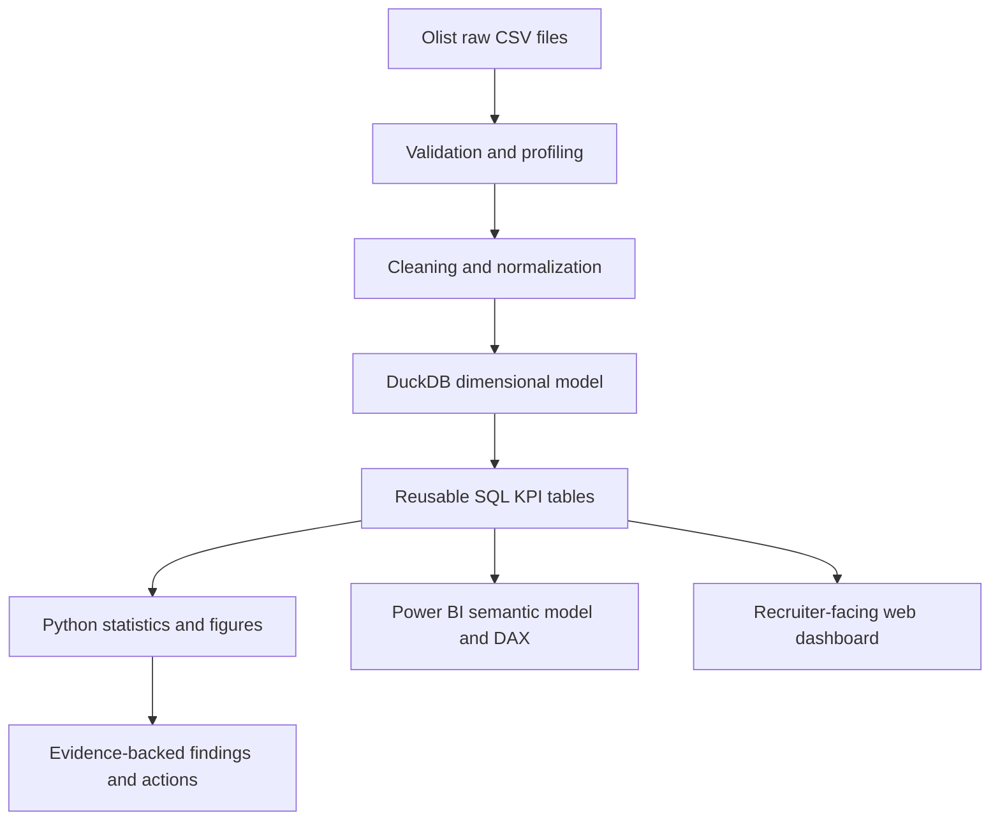

# Olist Marketplace Performance Intelligence

[](https://github.com/Pavithran-R-A/olist-marketplace-analytics/actions/workflows/ci.yml)
[](https://pavithran-r-a.github.io/olist-marketplace-analytics/)
[](powerbi/OlistMarketplace.pbip)

End-to-end marketplace analytics across **99,441 orders** and **R$13.59M GMV**, built with SQL, DuckDB, Python, statistical analysis, DAX, Power BI, automated data-quality checks, and CI-validated reporting.

**Project status: complete and recruiter-ready.** The Power BI project was opened, validated, saved, and reopened in Power BI Desktop with zero Problems. The public dashboard is deployed through GitHub Pages and the automated fixture pipeline is enforced in CI.

- **Live dashboard:** https://pavithran-r-a.github.io/olist-marketplace-analytics/
- **Power BI project:** [`powerbi/OlistMarketplace.pbip`](powerbi/OlistMarketplace.pbip)
- **Final readiness audit:** [`docs/hiring_readiness_audit.md`](docs/hiring_readiness_audit.md)
- **Methodology:** [`docs/methodology.md`](docs/methodology.md)
- **Metric dictionary:** [`docs/metric_dictionary.md`](docs/metric_dictionary.md)

## Recruiter snapshot

| KPI | Verified result |
|---|---:|
| GMV | R$13,591,643.70 |
| Orders | 99,441 |
| Customers | 96,096 |
| Average order value | R$136.68 |
| Late-delivery rate | 8.11% |
| Repeat-customer rate | 3.04% |
| Freight / GMV | 16.57% |
| Month-one weighted cohort retention | 0.45% |

Additional customer-experience finding: delivered late orders averaged **2.57** review points versus **4.29** for on-time orders.

> **Metric definition:** GMV means item merchandise value in this project. It does **not** mean Olist recognized revenue.

## Business problem

Marketplace leadership needs evidence about commercial activity, fulfillment reliability, freight burden, customer satisfaction, and repeat purchasing before prioritizing operational action.

The project answers that problem through a reproducible analytical path rather than a dashboard-only deliverable.



## What is included

- **Data acquisition and profiling** of the nine-file public Olist dataset.
- **Order-grain analytical model** with explicit metric definitions and reconciliation.
- **SQL analytics** covering KPIs, customers, fulfillment, sellers, freight, cohort retention, RFM segmentation, and Pareto concentration.
- **Python analysis** using pandas, NumPy, SciPy, and Plotly.
- **Data-quality gates** and automated reconciliation tests.
- **Power BI Desktop project** using PBIP/PBIR, a TMDL semantic model, explicit DAX measures, and three report pages.
- **Static recruiter dashboard** deployed through GitHub Pages.
- **Automated CI fixture pipeline** covering transformation, validation, analysis, dashboard generation, linting, dependency integrity, and pytest.

## Power BI report

The validated project is [`OlistMarketplace.pbip`](powerbi/OlistMarketplace.pbip). It uses Desktop-generated PBIR and TMDL with imported monthly, category, state, RFM, order-grain, and date-model outputs.

The report contains exactly three pages:

1. **Executive Overview**
2. **Fulfillment and Customer Experience**
3. **Customer and Growth**

Desktop reopened the saved PBIP successfully with **zero Problems**, and the headline measures reconcile to the verified Python and SQL outputs.

### Executive Overview


### Fulfillment and Customer Experience


### Customer and Growth


## Reproduce the analytical pipeline

Python **3.11+** is required.

```powershell
python -m pip install -e ".[dev]"
python -m src.acquire
python -m src.validate
python -m src.transform
python -m src.analyse
python -m src.build_dashboard_data
python -m src.dashboard
pytest
```

The acquisition command uses Kaggle public access when available. Raw source files are intentionally ignored by Git. CI runs against committed fixtures so validation does not depend on external credentials or network availability.

## Quality and verification

The CI workflow runs:

1. dependency installation and `pip check`;
2. Ruff linting;
3. fixture transformation;
4. validation and data-quality checks;
5. analysis and KPI generation;
6. recruiter-dashboard generation;
7. pytest reconciliation and regression tests.

Power BI Desktop validation is an explicit manual verification boundary because Desktop is not available on GitHub's Linux runner. The saved PBIP/PBIR/TMDL artifacts and screenshots are committed for recruiter inspection.

## Stack

**Analytics:** SQL, DuckDB, Python, pandas, NumPy, SciPy, Plotly  
**Business intelligence:** Power BI Desktop, DAX, PBIP, PBIR, TMDL  
**Quality:** pytest, Ruff, data validation, metric reconciliation  
**Delivery:** GitHub Actions, GitHub Pages

## Dataset and licensing

Source: [Brazilian E-Commerce Public Dataset by Olist](https://www.kaggle.com/datasets/olistbr/brazilian-ecommerce).

The Olist dataset is published under **CC BY-NC-SA 4.0**. Original project code is MIT-licensed. Dataset-derived material is documented separately in [`DATA_LICENSE.md`](DATA_LICENSE.md); the repository's MIT license does not override the source dataset license.

## Resume-ready summary

> Built an order-grain marketplace analytics pipeline across 99,441 orders and R$13.59M GMV using Python, SQL, DuckDB, DAX and Power BI, delivering reconciled KPIs for revenue-proxy GMV, fulfillment, customer experience and repeat purchasing with automated tests and CI.

For a deeper evidence checklist, see [`docs/hiring_readiness_audit.md`](docs/hiring_readiness_audit.md).
