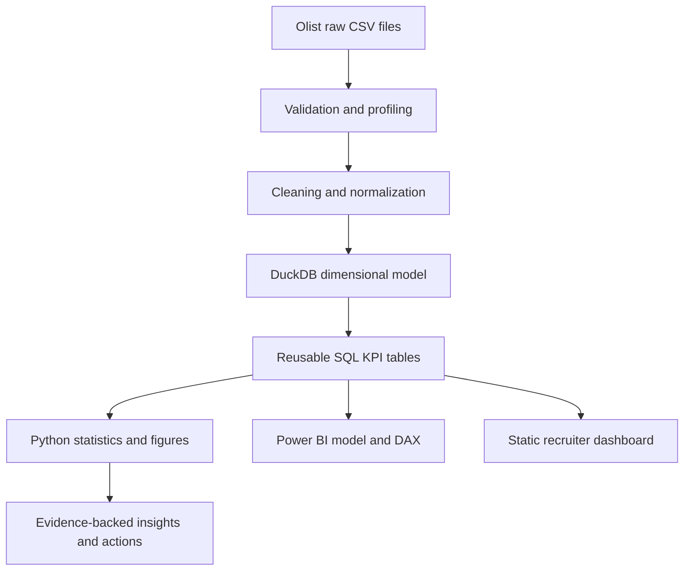

# Olist Marketplace Performance Intelligence

GMV, fulfillment, freight burden, customer experience, and repeat-purchase analytics for
an anonymized Brazilian e-commerce marketplace dataset.

## Business problem

Marketplace leadership needs evidence about activity, delivery reliability, freight burden,
customer satisfaction, and repeat purchasing before prioritizing operational action.

## Story



## Reproduce

```powershell
python -m pip install -e ".[dev]"
python -m src.acquire
python -m src.validate
python -m src.transform
python -m src.analyse
python -m src.build_dashboard_data
pytest
```

The acquisition command uses Kaggle public access when available. Raw files are ignored.
If authentication blocks acquisition, the validation report records that blocker.

## Stack

Python, pandas, NumPy, DuckDB, SQL, SciPy, Plotly, pytest, DAX, Power BI-ready TMDL,
GitHub Actions, and a static HTML dashboard.

## Dataset and terminology

Source: [Brazilian E-Commerce Public Dataset by Olist](https://www.kaggle.com/datasets/olistbr/brazilian-ecommerce).
GMV means item merchandise value in this project. It does not mean Olist recognized revenue.
See [metric dictionary](docs/metric_dictionary.md) and [methodology](docs/methodology.md).

## Deliverables

- SQL model and business queries under `sql/`.
- Reproducible Python pipeline under `src/`.
- Data-quality evidence under `reports/` and `docs/`.
- Recruiter-viewable dashboard under `dashboard/`.
- Power BI source specification and DAX under `powerbi/`.
- Tests, CI, insights, resume bullets, and interview walkthrough.

## Verification status

This README is updated after the pipeline runs. Claims in the final report distinguish
verified local outputs from unavailable external or Power BI Desktop validation.

