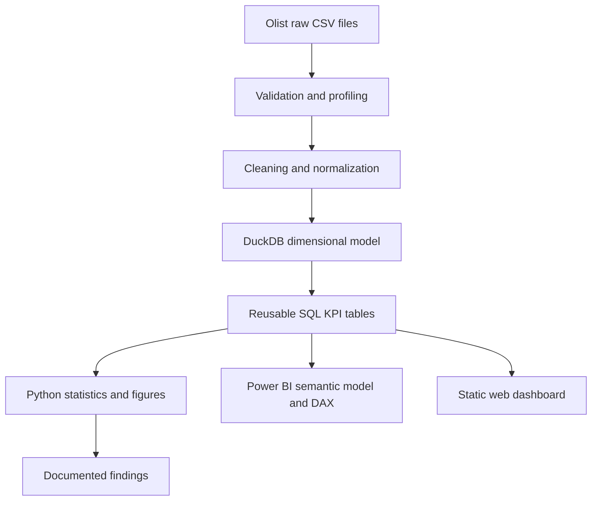

# Olist Marketplace Analytics

[](https://github.com/Pavithran-R-A/olist-marketplace-analytics/actions/workflows/ci.yml)
[](https://pavithran-r-a.github.io/olist-marketplace-analytics/)
[](powerbi/OlistMarketplace.pbip)

Analytics project built on the public Olist ecommerce dataset. The pipeline validates the source data, builds an order-grain DuckDB model, derives reusable KPI tables in SQL, runs statistical analysis in Python, and publishes reconciled outputs to Power BI and a static web dashboard.

The analysis covers **99,441 orders** and **R$13.59M in item GMV**. The Power BI project has been opened, saved, and reopened in Power BI Desktop with zero reported Problems, and its headline measures reconcile with the SQL and Python outputs. CI runs the fixture-backed transformation, validation, analysis, dashboard build, linting, and tests without depending on Kaggle credentials or network access.

- **Live dashboard:** https://pavithran-r-a.github.io/olist-marketplace-analytics/
- **Power BI project:** [`powerbi/OlistMarketplace.pbip`](powerbi/OlistMarketplace.pbip)
- **Verification audit:** [`docs/hiring_readiness_audit.md`](docs/hiring_readiness_audit.md)
- **Methodology:** [`docs/methodology.md`](docs/methodology.md)
- **Metric dictionary:** [`docs/metric_dictionary.md`](docs/metric_dictionary.md)

## Key results

| KPI | Verified result |
|---|---:|
| GMV | R$13,591,643.70 |
| Orders | 99,441 |
| Customers | 96,096 |
| Average order value | R$136.68 |
| Late-delivery rate | 8.11% |
| Repeat-customer rate | 3.04% |
| Freight / GMV | 16.57% |
| Month-one weighted cohort retention | 0.45% |

Delivered late orders averaged **2.57** review points, compared with **4.29** for on-time orders.

> **Metric definition:** GMV is item merchandise value in this project. It is not Olist recognized revenue.

## Analysis scope

The project examines five areas of marketplace performance:

- commercial activity and order value;
- fulfillment reliability and delivery delays;
- freight cost relative to merchandise value;
- customer-review outcomes;
- repeat purchasing, cohorts, RFM segments, and concentration.

The reporting layer is built from the same modeled and reconciled data used by the analysis rather than maintaining separate dashboard-only calculations.



## Repository contents

- **Data acquisition and profiling** for the nine-file public Olist dataset.
- **Order-grain analytical model** with explicit metric definitions and reconciliation.
- **SQL analytics** for KPIs, customers, fulfillment, sellers, freight, cohort retention, RFM segmentation, and Pareto concentration.
- **Python analysis** using pandas, NumPy, SciPy, and Plotly.
- **Data-quality checks** and automated metric reconciliation tests.
- **Power BI project** using PBIP/PBIR, a TMDL semantic model, explicit DAX measures, and three report pages.
- **Static web dashboard** deployed through GitHub Pages.
- **CI fixture pipeline** covering transformation, validation, analysis, dashboard generation, linting, dependency integrity, and pytest.

## Power BI report

The validated project is [`OlistMarketplace.pbip`](powerbi/OlistMarketplace.pbip). It uses Desktop-generated PBIR and TMDL with imported monthly, category, state, RFM, order-grain, and date-model outputs.

The report contains three pages:

1. **Executive Overview**
2. **Fulfillment and Customer Experience**
3. **Customer and Growth**

Power BI Desktop reopened the saved project successfully with **zero Problems**, and the headline measures reconcile with the verified Python and SQL outputs.

### Executive Overview


### Fulfillment and Customer Experience


### Customer and Growth


## Reproduce the analytical pipeline

Python **3.11+** is required.

```powershell
python -m pip install -e ".[dev]"
python -m src.acquire
python -m src.validate
python -m src.transform
python -m src.analyse
python -m src.build_dashboard_data
python -m src.dashboard
pytest
```

The acquisition command uses Kaggle public access when available. Raw source files are intentionally ignored by Git. CI runs against committed fixtures so validation does not depend on external credentials or network availability.

## Verification

The CI workflow runs:

1. dependency installation and `pip check`;
2. Ruff linting;
3. fixture transformation;
4. validation and data-quality checks;
5. analysis and KPI generation;
6. dashboard generation;
7. pytest reconciliation and regression tests.

Power BI Desktop validation remains an explicit manual boundary because Desktop is not available on GitHub's Linux runner. The saved PBIP/PBIR/TMDL artifacts and report screenshots are committed so the desktop result can be inspected separately from CI.

## Stack

**Analytics:** SQL, DuckDB, Python, pandas, NumPy, SciPy, Plotly  
**Business intelligence:** Power BI Desktop, DAX, PBIP, PBIR, TMDL  
**Quality:** pytest, Ruff, data validation, metric reconciliation  
**Delivery:** GitHub Actions, GitHub Pages

## Dataset and licensing

Source: [Brazilian E-Commerce Public Dataset by Olist](https://www.kaggle.com/datasets/olistbr/brazilian-ecommerce).

The Olist dataset is published under **CC BY-NC-SA 4.0**. Original project code is MIT-licensed. Dataset-derived material is documented separately in [`DATA_LICENSE.md`](DATA_LICENSE.md); the repository's MIT license does not override the source dataset license.

For the detailed verification checklist and remaining caveats, see [`docs/hiring_readiness_audit.md`](docs/hiring_readiness_audit.md).
