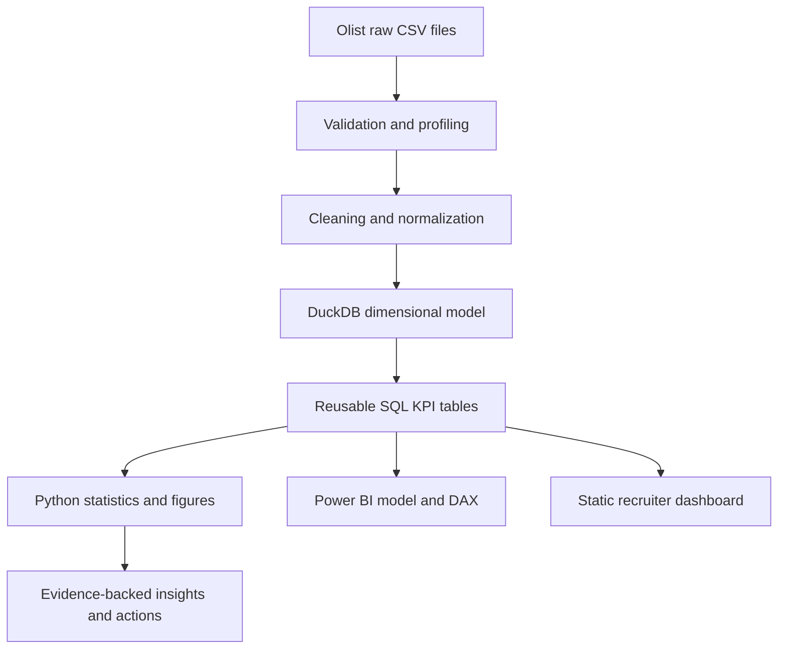
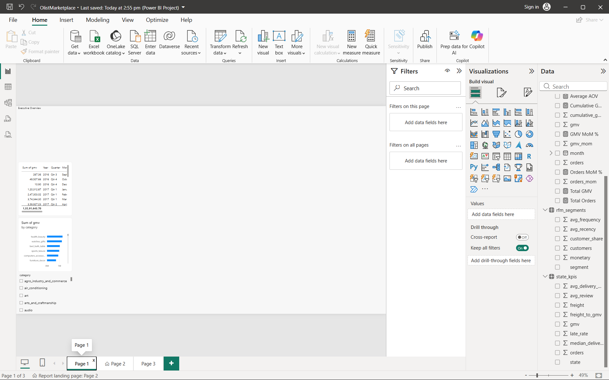
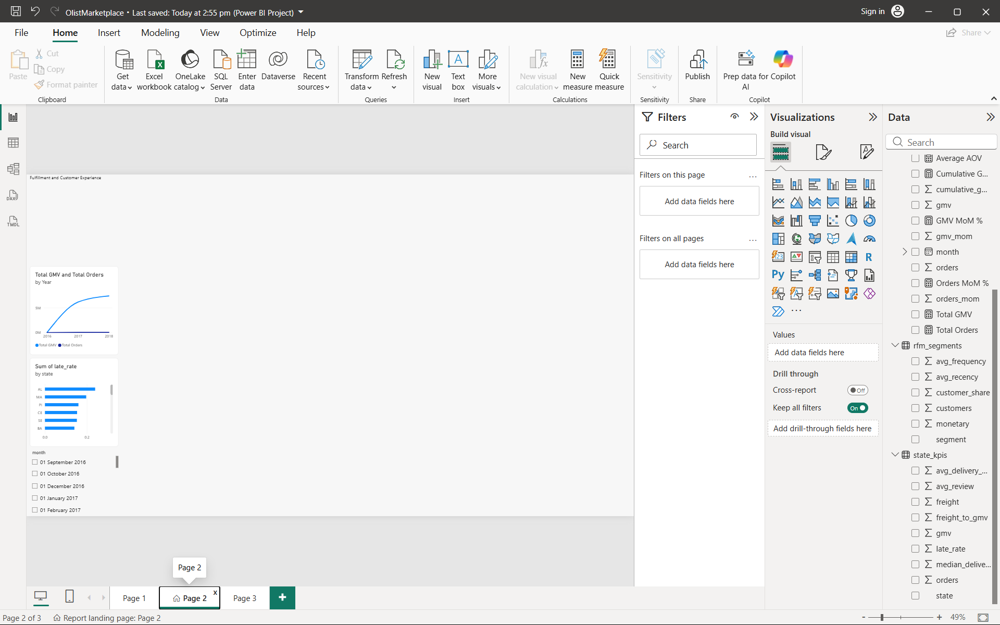
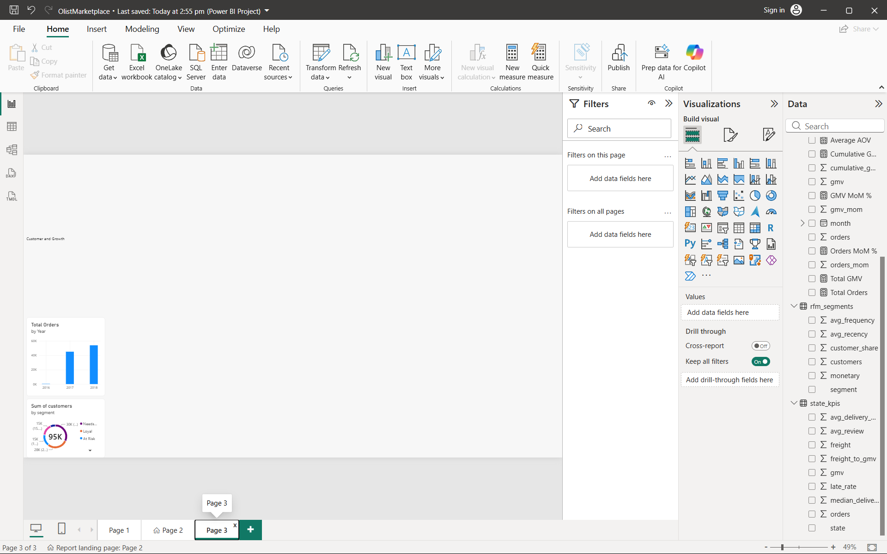

# Olist Marketplace Performance Intelligence

GMV, fulfillment, freight burden, customer experience, and repeat-purchase analytics for
an anonymized Brazilian e-commerce marketplace dataset.

## Business problem

Marketplace leadership needs evidence about activity, delivery reliability, freight burden,
customer satisfaction, and repeat purchasing before prioritizing operational action.

## Story



## Reproduce

```powershell
python -m pip install -e ".[dev]"
python -m src.acquire
python -m src.validate
python -m src.transform
python -m src.analyse
python -m src.build_dashboard_data
pytest
```

The acquisition command uses Kaggle public access when available. Raw files are ignored.
If authentication blocks acquisition, the validation report records that blocker.

## Stack

Python, pandas, NumPy, DuckDB, SQL, SciPy, Plotly, pytest, DAX, Power BI Desktop,
PBIP/TMDL, GitHub Actions, and a static HTML dashboard.

## Dataset and terminology

Source: [Brazilian E-Commerce Public Dataset by Olist](https://www.kaggle.com/datasets/olistbr/brazilian-ecommerce).
GMV means item merchandise value in this project. It does not mean Olist recognized revenue.
See [metric dictionary](docs/metric_dictionary.md) and [methodology](docs/methodology.md).

## Deliverables

- SQL model and business queries under `sql/`.
- Reproducible Python pipeline under `src/`.
- Data-quality evidence under `reports/` and `docs/`.
- Recruiter-viewable dashboard under `dashboard/`.
- Power BI Desktop-validated PBIP project and three-page report under `powerbi/`.
- Tests, CI, insights, resume bullets, and interview walkthrough.

## Verified headline findings

- R$13.59M GMV across 99,441 orders; AOV was R$136.68.
- 8.11% of delivered orders were late.
- Late orders averaged 2.57 reviews versus 4.29 on time.
- Freight equaled 16.57% of GMV.
- Repeat-customer rate was 3.04% after excluding canceled and unavailable orders.
- Month-one weighted cohort retention was 0.45%; RFM uses dataset quintiles.

Open the [live dashboard](https://pavithran-r-a.github.io/olist-marketplace-analytics/) or
`dashboard/index.html` locally. The public repository is available at
[Pavithran-R-A/olist-marketplace-analytics](https://github.com/Pavithran-R-A/olist-marketplace-analytics).

## Power BI report

The validated project is [OlistMarketplace.pbip](powerbi/OlistMarketplace.pbip). It uses
Desktop-generated PBIR and TMDL, with imported monthly, category, state, and RFM KPI
tables. The report contains exactly three pages: Executive Overview, Fulfillment and
Customer Experience, and Customer and Growth. Real visuals include monthly trends,
category GMV, state late-rate, RFM customers, and report slicers.







Desktop reopened the PBIP successfully with zero Problems. Headline reconciliation
remains grounded in the verified Python and SQL outputs above.

## Verification status

This README is updated after the pipeline runs. Claims in the final report distinguish
verified local outputs from unavailable external or Power BI Desktop validation.
